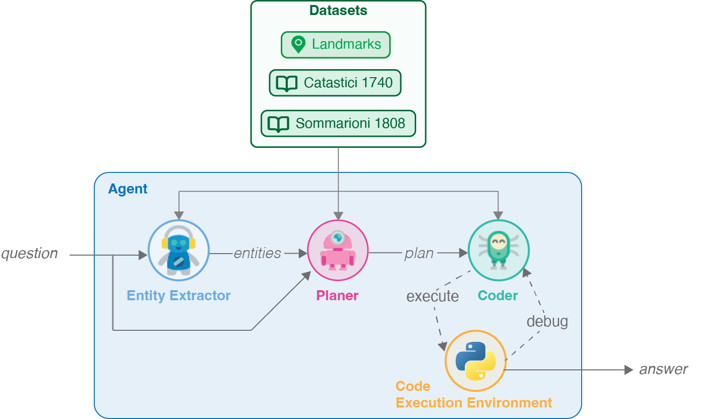

This is the implementation of **Coding Agents** from the paper **LLM Agents for Interactive Exploration of Historical Cadastre Data: Framework and Application to Venice**, based on [GPT-4o mini](https://openai.com/index/gpt-4o-mini-advancing-cost-efficient-intelligence/) model.

<p align="center">
  
</p>

## Overview

The DHLab Venice LLM Agent is designed to process and analyze historical building data from Venice, specifically focusing on property ownership records from 1740 and 1808. The system uses a multi-step workflow to:

- Extract relevant entities from natural language queries
- Create structured analysis plans
- Generate and execute Python code for data processing
- Validate outputs and provide comprehensive results

## Features

- **Intelligent Query Processing**: Converts natural language questions into structured data analysis
- **Multi-Dataset Support**: Handles historical building data from multiple time periods (1740, 1808)
- **Automated Code Generation**: Creates Python scripts for data manipulation and analysis
- **Output Validation**: Ensures results meet specified format requirements
- **Visual Workflow**: Provides Mermaid diagram visualization of the processing pipeline

## Installation

### Setup

1. **Create a new conda environment:**
   ```bash
   conda create --name agents python=3.10 -y
   conda activate agents
   ```

2. **Install the required packages:**
   ```bash
   pip install -r requirements.txt
   ```

3. **Set up your OpenAI API key:**
   ```bash
   export OPENAI_API_KEY="your-api-key-here"
   ```

## Usage

### Basic Usage

The agent processes natural language queries about Venetian building data and returns structured results. Here's how to use it:

#### 1. Initialize the Environment

```python
import os
import getpass
from agent import graph
from utils.utils import get_openai_llm

# Set up your OpenAI API key
api_key = getpass.getpass("Enter OPENAI_API_KEY: ")
os.environ['OPENAI_API_KEY'] = api_key

# Initialize the OpenAI model
llm = get_openai_llm(seed=42)
```

#### 2. Prepare Your Query

```python
import pandas as pd

# Load sample questions
questions = pd.read_csv('data/questions_sql.csv')
sample_question = questions.iloc[10]

print(sample_question['question'])
# Output: "Could you enumerate all individuals who possess ownership of properties?"
```

#### 3. Execute the Agent

```python
# Run the graph with your query
final_state = graph.invoke({
    "llm": llm,
    "question": sample_question['question'],
    "answer_format": sample_question['answer_format'],
    "num_steps": 0
})
```

#### 4. View Results

The agent returns a comprehensive result containing:
- **References**: Relevant datasets and columns identified
- **Entities**: Extracted entities from the query
- **Plan**: Step-by-step analysis strategy
- **Code**: Generated Python code for data processing
- **Answer**: Final formatted results

## Data Sources

The system works with the following datasets:

- **`buildings_1740.csv`**: Venetian building records from 1740
- **`buildings_1808.csv`**: Venetian building records from 1808
- **`landmarks.csv`**: Historical landmarks data
- **`questions_sql.csv`**: Sample queries for testing

Each dataset contains detailed information about:
- Property ownership (first names, family names)
- Building characteristics
- Geographic locations
- Historical context

## Project Structure

```
dhlab/
├── agent.py              # Main LangGraph workflow definition
├── demo.ipynb            # Interactive demonstration notebook
├── requirements.txt      # Python dependencies
├── data/                 # Historical datasets
│   ├── buildings_1740.csv
│   ├── buildings_1808.csv
│   ├── landmarks.csv
│   └── questions_sql.csv
└── utils/                # Core functionality modules
    ├── nodes.py          # Workflow node implementations
    ├── state.py          # State management
    ├── utils.py          # Utility functions
    └── prompts.py        # LLM prompts
```

## Workflow Architecture

The agent follows a sophisticated multi-step workflow:

1. **Entity Extraction**: Identifies relevant datasets and columns
2. **Plan Creation**: Develops structured analysis strategy
3. **Code Generation**: Creates Python code for data processing
4. **Execution**: Runs the generated code
5. **Validation**: Checks output format and quality
6. **Result Compilation**: Finalizes and formats results
