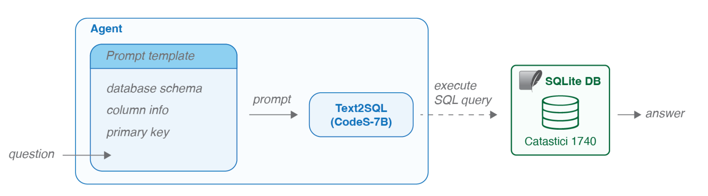

This is the implementation of **SQL Agent** from the paper **LLM Agents for Interactive Exploration of Historical Cadastre Data: Framework and Application to Venice**, based on [CodeS-7B](https://huggingface.co/seeklhy/codes-7b) model.

<p align="center">
  
</p>

The script runs in a loop asking the user to enter a question. Enter `exit` to finish the execution.

## Installation

### Setup

1. **Create a new conda environment:**
   ```bash
   conda create --name sql_agent python=3.10 -y
   conda activate sql_agent
   ```

2. **Install the required packages:**
   ```bash
   pip install -r requirements.txt
   ```

3. **Set up your HuggingFace token ID:**
   ```bash
   export HF_TOKEN="your-token-here"
   ```

## Usage

Show the intermediate steps (generated sql and predicted answer) by setting `verbose=True` as follows:
```python
python run.py --verbose True
```

Get the answer in Natural Language by setting `answer_in_nl=True` as follows:
```python
python run.py --answer_in_nl True
```

_NOTE:_ 
- _either `verbose` or `answer_in_nl` must be set to `True`_
- _`answer_in_nl=True` requires 2 GPUs_

### Formats of asking a question

The questions must be based on the [catastici](data/catastici.csv) dataset. Follow the following format for more accurate answers.

- Give the entity names in `" "`.
    - e.g. _How many properties does "Filippo" "Frari" have?_
- Make the questions as explicit as possible.
    - e.g. _How many properties of type "casa" does "Filippo" "Frari" own?_, instead of _How many "casa" does "Filippo" "Frari" own?_